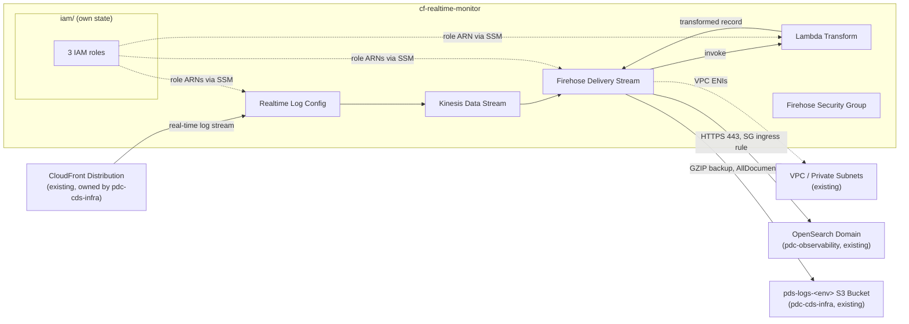

# cf-realtime-monitor

AWS infrastructure that captures CloudFront real-time access logs for PDS data-node
distributions, transforms them, and delivers them to OpenSearch for monitoring/analytics.

The real content of this repo is the Terraform package under [`terraform/`](./terraform/README.md)
— see its README for the technical architecture, deploy, and destroy instructions. IAM roles live
in their own standalone [`terraform/iam/`](./terraform/iam/README.md) root module.

This repo was created from NASA-PDS's `template-repo-python` template; the `src/pds/` and
`tests/pds/` directories are unmodified template scaffolding, not part of the actual deliverable.

## Architecture

This repo creates the log-capture pipeline; it does **not** own the CloudFront distribution, the
OpenSearch domain, the VPC/subnets, or the S3 backup bucket — those are existing resources looked
up via `data` sources or passed in as variables. See
[`terraform/README.md`](./terraform/README.md#deployment-architecture) for the cross-repo
deployment order and the full technical architecture.
