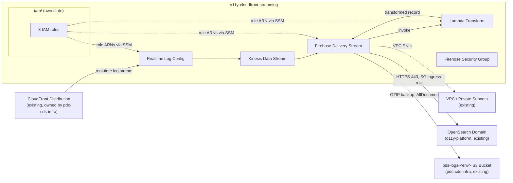

# PDS CloudFront Real-Time Logging Terraform

AWS infrastructure that captures CloudFront real-time access logs for PDS data-node
distributions, transforms them, and delivers them to OpenSearch for monitoring/analytics.

The real content of this repo is the Terraform package under [`terraform/`](./terraform/README.md)
— see its README for the technical architecture, deploy, and destroy instructions. IAM roles live
in their own standalone [`terraform/iam/`](./terraform/iam/README.md) root module.

This repo was created from NASA-PDS's `template-repo-python` template; the `src/pds/` and
`tests/pds/` directories are unmodified template scaffolding, not part of the actual deliverable.

This incremental package creates and configures:

1. 3 IAM execution roles (CloudFront→Kinesis, Firehose, Lambda) — own state in `iam/`
2. Kinesis Data Stream: `pds-o11y-cloudfront-streaming-kinesis`
3. Lambda transform function: `pds-o11y-cloudfront-streaming-transform`
4. Firehose delivery stream: `pds-o11y-cloudfront-streaming-firehose`
5. Firehose security group: `pds-o11y-cloudfront-streaming-firehose-sg` + OpenSearch SG ingress rule
6. CloudWatch log group for Lambda

The CloudFront real-time log configuration (`pds-o11y-cloudfront-streaming-log-config`) is owned by
`pdc-cds-infra/cloudfront/pds-main`, not this repo — deploy that module after this one.

## Architecture



This repo creates the log-capture pipeline; it does **not** own the CloudFront distribution, the
OpenSearch domain, the VPC/subnets, or the S3 backup bucket — those are existing resources looked
up via `data` sources or passed in as variables. See
[`terraform/README.md`](./terraform/README.md#deployment-architecture) for the cross-repo
deployment order and the full technical architecture.


## Firehose delivery stream

Terraform creates:

```text
pds-o11y-cloudfront-streaming-firehose
```

The stream:

- Reads from `pds-o11y-cloudfront-streaming-kinesis`
- Invokes `pds-o11y-cloudfront-streaming-transform` using `$LATEST`
- Delivers transformed records to the existing `pds-<env>-o11y` domain
- Writes to the daily-rotated `pds-o11y-cloudfront-streaming-index` index
- Uses the existing private subnets and `pds-o11y-cloudfront-streaming-firehose-sg`
- Backs up all documents to the existing S3 backup bucket in GZIP format
- Uses a 1 MiB OpenSearch buffer and the provider-supported 60-second interval
- Retries OpenSearch delivery for 300 seconds

S3 object prefixes:

```text
backup/YYYY/MM/DD/HH/
errors/<error-type>/YYYY/MM/DD/HH/
```

The Lambda processor receives up to 1 MiB per invocation or records accumulated
for 60 seconds, whichever threshold is reached first.

## CloudFront real-time log configuration

The `aws_cloudfront_realtime_log_config` resource is owned by `pdc-cds-infra/cloudfront/pds-main`,
not by this module. That stack reads the Kinesis stream ARN from SSM
(`/pds/o11y-cloudfront-streaming/kinesis/kinesis-stream-arn`) and the CloudFront IAM role ARN from
SSM (`/pds/o11y-cloudfront-streaming/cloudfront/cloudfront-role-arn`) — both published by this
module — and creates `pds-o11y-cloudfront-streaming-log-config`. Deploy this module first so those
SSM parameters exist before `pds-main` is planned.

## Existing OpenSearch domain

The domain is not created or managed here. The OpenSearch security group ID is read from SSM at
`/pds/o11y-platform/opensearch/opensearch_security_group_id` (published by o11y-platform) — no
manual SG ID input is needed. The access policy granting this module's Firehose role write access is
managed by o11y-platform's `o11y_cloudfront_streaming_enabled` flag (flip to `true` and re-apply
o11y-platform after this module's `iam/` is deployed).

Fine-grained access control is unchanged and remains disabled.

## Existing network resources

Supply these existing resource IDs in `tfvars/<venue>.tfvars`:

```hcl
vpc_id             = "vpc-..."
private_subnet_ids = ["subnet-...", "subnet-..."]
```

`private_subnet_ids` is used by the Firehose VPC configuration. The OpenSearch security group ID is
read from SSM — see [Existing OpenSearch domain](#existing-opensearch-domain).

## Firehose security group

Terraform creates:

```text
pds-o11y-cloudfront-streaming-firehose-sg
```

Rules:

- No inbound rules on the Firehose security group
- Outbound: all IPv4 protocols and ports to `0.0.0.0/0`
- Existing OpenSearch SG inbound: TCP 443 from the Firehose SG

## OpenSearch ingest path

Firehose OpenSearch destination settings:

```text
Base index: pds-o11y-cloudfront-streaming-index
Rotation:   OneDay
Pattern:    pds-o11y-cloudfront-streaming-index-YYYY-MM-DD
```

After Firehose is created and records are delivered, use OpenSearch Dashboards
Dev Tools to locate the indexes:

```http
GET _cat/indices/pds-o11y-cloudfront-streaming-index-*?v&s=index
```

Use this data-view pattern in OpenSearch Dashboards:

```text
pds-o11y-cloudfront-streaming-index-*
```

Select `@timestamp` as the time field.

## S3 backup bucket

Firehose backs up all documents to the existing `pds-logs-<env>` S3 bucket (managed by
pdc-cds-infra), passed in as `pds_logs_bucket_arn`. This module does not create an S3 bucket.

## Other resource settings


### Kinesis stream

```text
pds-o11y-cloudfront-streaming-kinesis
```

- On-demand mode
- 90-day retention (`2160` hours)
- Server-side encryption disabled

### Lambda transform

```text
pds-o11y-cloudfront-streaming-transform
```

- Python 3.12
- `x86_64`
- 512 MB memory
- 300-second timeout
- 512 MB ephemeral storage
- `$LATEST` (`publish = false`)
- 30-day CloudWatch Logs retention

## Deploy

Deployment is managed via [cds-infra-deploy](https://github.com/NASA-PDS/cds-infra-deploy) (private)
using Terragrunt. Deploy `iam/` first, then `streaming/` — the main module reads IAM role ARNs from SSM.

**Prerequisites:** o11y-platform's OpenSearch domain must be deployed first (any value of
`o11y_cloudfront_streaming_enabled`). See [o11y-platform](https://github.com/NASA-PDS/o11y-platform)
for the full cross-repo deployment sequence.

**Primary (Terragrunt):**
```bash
cd /path/to/cds-infra-deploy

eval $(aws configure export-credentials --profile <your-profile> --format env)
unset AWS_PROFILE

# 1. IAM roles (Admin — iam:CreateRole, iam:AttachRolePolicy)
terragrunt plan  --terragrunt-working-dir venues/<venue>/o11y-cloudfront-streaming/iam
terragrunt apply --terragrunt-working-dir venues/<venue>/o11y-cloudfront-streaming/iam

# 2. Streaming resources (PowerUser)
terragrunt plan  --terragrunt-working-dir venues/<venue>/o11y-cloudfront-streaming/streaming
terragrunt apply --terragrunt-working-dir venues/<venue>/o11y-cloudfront-streaming/streaming
```

**Fallback (local iteration via Task — use `LOCAL=1` to read from repo-local gitignored tfvars):**
```bash
cd terraform/
task iam:plan       VENUE=dev LOCAL=1
task iam:deploy     VENUE=dev LOCAL=1
task streaming:plan   VENUE=dev LOCAL=1
task streaming:deploy VENUE=dev LOCAL=1
```

After deploy, run the smoke test:
```bash
AWS_PROFILE=<your-profile> bash scripts/smoke-test-realtime-stream.sh dev
```

See [Deployment flow](terraform/README.md#deployment-flow) for the full cross-repo sequence
including granting OpenSearch access (o11y-platform re-apply) and wiring CloudFront (pdc-cds-infra).

## Destroy

```bash
# Destroy streaming first, then iam
task streaming:destroy VENUE=dev
task iam:destroy       VENUE=dev
```

The OpenSearch domain, VPC, subnets, and S3 backup bucket are not destroyed by this module.
