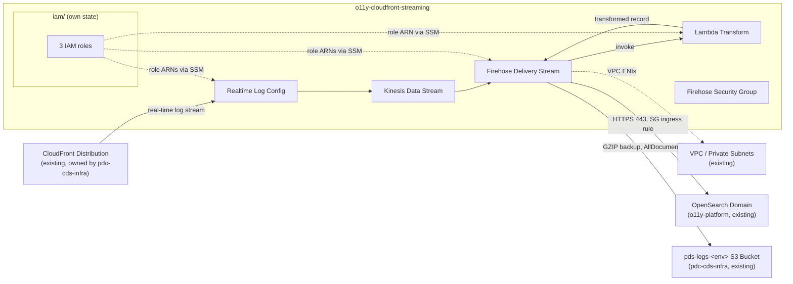

# PDS CloudFront Real-Time Logging Terraform

AWS infrastructure that captures CloudFront real-time access logs for PDS data-node
distributions, transforms them, and delivers them to OpenSearch for monitoring/analytics.

The real content of this repo is the Terraform package under [`terraform/`](./terraform/README.md)
— see its README for the technical architecture, deploy, and destroy instructions. IAM roles live
in their own standalone [`terraform/iam/`](./terraform/iam/README.md) root module.

This repo was created from NASA-PDS's `template-repo-python` template; the `src/pds/` and
`tests/pds/` directories are unmodified template scaffolding, not part of the actual deliverable.

This incremental package creates and configures:

1. `pds-cloudfront-realtime-log-transform-lambda-role`
2. `pds-cloudfront-realtime-log-kinesis-role`
3. `pds-cloudfront-realtime-firehose-role`
4. S3 Firehose backup bucket
5. Kinesis Data Stream
6. Lambda transform function
7. Firehose security group and OpenSearch security-group ingress
8. A data-source reference to the existing OpenSearch domain
9. CloudFront real-time log configuration
10. Kinesis Data Firehose delivery stream

## Architecture



This repo creates the log-capture pipeline; it does **not** own the CloudFront distribution, the
OpenSearch domain, the VPC/subnets, or the S3 backup bucket — those are existing resources looked
up via `data` sources or passed in as variables. See
[`terraform/README.md`](./terraform/README.md#deployment-architecture) for the cross-repo
deployment order and the full technical architecture.


## Firehose delivery stream

Terraform creates:

```text
pds-cloudfront-realtime-firehose
```

The stream:

- Reads from `pds-cloudfront-realtime-kinesis-stream`
- Invokes `pds-cloudfront-realtime-log-transform` using `$LATEST`
- Delivers transformed records to the existing `pds-<env>-o11y` domain
- Writes to the daily-rotated `pds-cloudfront-realtime-index` index
- Uses the existing private subnets and `pds-cloudfront-realtime-firehose-sg`
- Backs up all documents to the existing S3 backup bucket in GZIP format
- Uses a 1 MiB OpenSearch buffer and the provider-supported 60-second interval
- Retries OpenSearch delivery for 300 seconds

S3 object prefixes:

```text
backup/YYYY/MM/DD/HH/
errors/<error-type>/YYYY/MM/DD/HH/
```

The Lambda processor receives up to 1 MiB per invocation or records accumulated
for 60 seconds, whichever threshold is reached first.

## CloudFront real-time log configuration

Terraform creates:

```text
pds-cloudfront-realtime-log-config
```

Settings:

- Sampling rate: `100` percent
- Destination: the Kinesis stream created by this package
- IAM role: `pds-cloudfront-realtime-log-kinesis-role`
- Fields: the 17 fields required by the Lambda transform, in the exact parsing order

This package creates the real-time log configuration but does not manage the
existing CloudFront distribution. In the Terraform stack that owns the
distribution, add the configuration ARN to both existing ordered cache
behaviors:

```hcl
ordered_cache_behavior {
  path_pattern            = "/data*"
  realtime_log_config_arn = <this-package-cloudfront_realtime_log_config_arn>

  # Keep the existing behavior settings unchanged.
}

ordered_cache_behavior {
  path_pattern            = "/data/store/img*"
  realtime_log_config_arn = <this-package-cloudfront_realtime_log_config_arn>

  # Keep the existing behavior settings unchanged.
}
```

CloudFront evaluates ordered cache behaviors by precedence. Preserve the
existing ordering, especially because `/data/store/img*` is more specific than
`/data*`.

## Existing OpenSearch domain

The package does not create or manage the domain. It reads:

```text
pds-<env>-o11y
```

through `data.aws_opensearch_domain.o11y`.

The package also does not replace the domain access policy. The Terraform stack
that owns the existing domain must add the Firehose role principal with
`es:*` access to the domain ARN and `domain-arn/*`. This avoids overwriting
existing Logstash or administrator access.

Fine-grained access control is unchanged and remains disabled.

## Existing network resources

Supply these existing resource IDs in `terraform.tfvars`:

```hcl
vpc_id                      = "vpc-..."
private_subnet_ids           = ["subnet-...", "subnet-..."]
opensearch_security_group_id = "sg-..."
```

`private_subnet_ids` is used by the Firehose VPC configuration.

## Firehose security group

Terraform creates:

```text
pds-cloudfront-realtime-firehose-sg
```

Rules:

- No inbound rules on the Firehose security group
- Outbound: all IPv4 protocols and ports to `0.0.0.0/0`
- Existing OpenSearch SG inbound: TCP 443 from the Firehose SG

## OpenSearch ingest path

Firehose OpenSearch destination settings:

```text
Base index: pds-cloudfront-realtime-index
Rotation:   OneDay
Pattern:    pds-cloudfront-realtime-index-YYYY-MM-DD
```

After Firehose is created and records are delivered, use OpenSearch Dashboards
Dev Tools to locate the indexes:

```http
GET _cat/indices/pds-cloudfront-realtime-index-*?v&s=index
```

Use this data-view pattern in OpenSearch Dashboards:

```text
pds-cloudfront-realtime-index-*
```

Select `@timestamp` as the time field.

## Existing S3 backup bucket

Use existing S3 bucket for Firehose backup

```text
pds-logs-<env>
```

## Other resource settings


### Kinesis stream

```text
pds-cloudfront-realtime-kinesis-stream
```

- On-demand mode
- 90-day retention (`2160` hours)
- Server-side encryption disabled

### Lambda transform

```text
pds-cloudfront-realtime-log-transform
```

- Python 3.12
- `x86_64`
- 512 MB memory
- 300-second timeout
- 512 MB ephemeral storage
- `$LATEST` (`publish = false`)
- 30-day CloudWatch Logs retention

## Deploy

```bash
cp -p terraform.tfvars.example terraform.tfvars
# Replace the example VPC, subnet, and OpenSearch SG IDs.

terraform init
terraform fmt -check
terraform validate

PLAN="tfplan.$(date +%Y%m%d.%H%M)"
terraform plan -out="$PLAN"
terraform show "$PLAN"
terraform apply "$PLAN"
```

## Destroy

The OpenSearch domain, VPC, subnets, and existing OpenSearch security group are
not destroyed by this package. Terraform removes only the new ingress rule and
the Firehose security group created here.

```bash
DESTROY_PLAN="tfplan.destroy.$(date +%Y%m%d.%H%M)"
terraform plan -destroy -out="$DESTROY_PLAN"
terraform apply "$DESTROY_PLAN"
```
