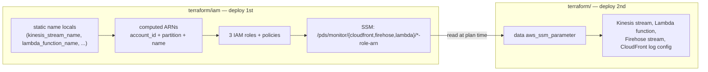

# PDS CloudFront Real-Time Logging — Terraform

Creates and configures the CloudFront real-time logging pipeline for PDS data-node
distributions: a Kinesis Data Stream, a Lambda transform function, a Firehose delivery stream to
OpenSearch (with S3 backup), the supporting IAM roles, a Firehose security group, and the
CloudFront real-time log configuration itself.

This package does **not** own the CloudFront distribution, the OpenSearch domain, the
VPC/subnets, or the S3 backup bucket — those are looked up via `data` sources or passed in as
variables and referenced by convention-based names (see `locals.tf`).

IAM roles live in the standalone [`iam/`](./iam/README.md) root module (its own state) — deploy
it first; see [Deploy](#deploy) below.

## Deployment architecture

`iam/` and this module would naturally depend on each other: the IAM policies need ARNs for
resources this module creates (the Kinesis stream, the Lambda function), while this module needs
the role ARNs back for the CloudFront log config, Firehose, and Lambda. Every resource name here
is a static literal (no random suffixes), so `iam/` **computes** the ARNs it needs from
`data.aws_caller_identity` + `data.aws_partition` + the same name locals, instead of reading a
live resource attribute. That breaks the cycle: `iam/` can apply with zero knowledge of whether
this module's resources exist yet.



Deploy `iam/` first (see [`iam/README.md`](./iam/README.md)); this module reads its role ARNs
back via `data "aws_ssm_parameter"` rather than an in-module `depends_on`. This module also needs
the existing VPC/subnets and the S3 backup bucket — supplied via `tfvars/<venue>.tfvars` (see
[Inputs](#inputs) below) — and does a live `data "aws_opensearch_domain"` lookup against the
existing `pds-<env>-observability` domain (for its ARN/endpoint), so it cannot plan until that
domain exists. The OpenSearch domain's security group ID is *not* a tfvar — it's read via
`data "aws_ssm_parameter"` from `/pds/observability/opensearch/opensearch_security_group_id`,
published by [pdc-observability](https://github.com/NASA-PDS/pdc-observability)'s `opensearch`
module on every deploy. See [Existing OpenSearch domain](#existing-opensearch-domain) below for
the one thing this doesn't get you for free: OpenSearch access.

Once applied, this module publishes the Kinesis stream ARN and IAM role ARNs to SSM. The
`pdc-cds-infra/cloudfront/pds-main` module reads those SSM parameters to create the
`aws_cloudfront_realtime_log_config` and wire it to the `/data*` and `/data/store/img*` cache
behaviors — deploy `pds-main` after this module.

<!-- BEGIN_TF_DOCS -->
## Requirements

| Name | Version |
| ---- | ------- |
| <a name="requirement_terraform"></a> [terraform](#requirement\_terraform) | >= 1.10.0 |
| <a name="requirement_archive"></a> [archive](#requirement\_archive) | ~> 2.4 |
| <a name="requirement_aws"></a> [aws](#requirement\_aws) | ~> 6.0 |

## Providers

| Name | Version |
| ---- | ------- |
| <a name="provider_archive"></a> [archive](#provider\_archive) | 2.8.0 |
| <a name="provider_aws"></a> [aws](#provider\_aws) | 6.57.1 |

## Modules

No modules.

## Resources

| Name | Type |
| ---- | ---- |
| [aws_cloudwatch_log_group.cloudfront_realtime_transform](https://registry.terraform.io/providers/hashicorp/aws/latest/docs/resources/cloudwatch_log_group) | resource |
| [aws_kinesis_firehose_delivery_stream.cloudfront_realtime](https://registry.terraform.io/providers/hashicorp/aws/latest/docs/resources/kinesis_firehose_delivery_stream) | resource |
| [aws_kinesis_stream.cloudfront_realtime](https://registry.terraform.io/providers/hashicorp/aws/latest/docs/resources/kinesis_stream) | resource |
| [aws_lambda_function.cloudfront_realtime_transform](https://registry.terraform.io/providers/hashicorp/aws/latest/docs/resources/lambda_function) | resource |
| [aws_security_group.firehose](https://registry.terraform.io/providers/hashicorp/aws/latest/docs/resources/security_group) | resource |
| [aws_ssm_parameter.kinesis_stream_arn](https://registry.terraform.io/providers/hashicorp/aws/latest/docs/resources/ssm_parameter) | resource |
| [aws_vpc_security_group_egress_rule.firehose_all_ipv4](https://registry.terraform.io/providers/hashicorp/aws/latest/docs/resources/vpc_security_group_egress_rule) | resource |
| [aws_vpc_security_group_ingress_rule.opensearch_https_from_firehose](https://registry.terraform.io/providers/hashicorp/aws/latest/docs/resources/vpc_security_group_ingress_rule) | resource |
| [archive_file.cloudfront_realtime_transform](https://registry.terraform.io/providers/hashicorp/archive/latest/docs/data-sources/file) | data source |
| [aws_caller_identity.current](https://registry.terraform.io/providers/hashicorp/aws/latest/docs/data-sources/caller_identity) | data source |
| [aws_opensearch_domain.observability](https://registry.terraform.io/providers/hashicorp/aws/latest/docs/data-sources/opensearch_domain) | data source |
| [aws_partition.current](https://registry.terraform.io/providers/hashicorp/aws/latest/docs/data-sources/partition) | data source |
| [aws_ssm_parameter.cloudfront_role_arn](https://registry.terraform.io/providers/hashicorp/aws/latest/docs/data-sources/ssm_parameter) | data source |
| [aws_ssm_parameter.firehose_role_arn](https://registry.terraform.io/providers/hashicorp/aws/latest/docs/data-sources/ssm_parameter) | data source |
| [aws_ssm_parameter.lambda_execution_role_arn](https://registry.terraform.io/providers/hashicorp/aws/latest/docs/data-sources/ssm_parameter) | data source |
| [aws_ssm_parameter.opensearch_security_group_id](https://registry.terraform.io/providers/hashicorp/aws/latest/docs/data-sources/ssm_parameter) | data source |

## Inputs

| Name | Description | Type | Default | Required |
| ---- | ----------- | ---- | ------- | :------: |
| <a name="input_pds_logs_bucket_arn"></a> [pds\_logs\_bucket\_arn](#input\_pds\_logs\_bucket\_arn) | ARN of the pre-existing pds-logs-<env> S3 bucket where Firehose backup records are written. | `string` | n/a | yes |
| <a name="input_private_subnet_ids"></a> [private\_subnet\_ids](#input\_private\_subnet\_ids) | IDs of the existing private subnets Firehose will use for its VPC ENIs. | `list(string)` | n/a | yes |
| <a name="input_vpc_id"></a> [vpc\_id](#input\_vpc\_id) | ID of the existing VPC containing the private subnets and OpenSearch domain. | `string` | n/a | yes |
| <a name="input_aws_region"></a> [aws\_region](#input\_aws\_region) | AWS region used by the provider and regional resources. | `string` | `"us-west-2"` | no |
| <a name="input_cicd"></a> [cicd](#input\_cicd) | CI/CD tag. | `string` | `"terraform"` | no |
| <a name="input_component"></a> [component](#input\_component) | Component tag. Matches the GitHub repository name. | `string` | `"cf-realtime-monitor"` | no |
| <a name="input_env"></a> [env](#input\_env) | Deployment env. | `string` | `"dev"` | no |
| <a name="input_managedby"></a> [managedby](#input\_managedby) | Managing organization or team tag. | `string` | `"viviant@jpl.caltech.edu"` | no |
| <a name="input_node"></a> [node](#input\_node) | PDS node abbreviation, using lowercase letters only, such as en, img, or sbn. | `string` | `"en"` | no |
| <a name="input_pds_logs_firehose_prefix"></a> [pds\_logs\_firehose\_prefix](#input\_pds\_logs\_firehose\_prefix) | S3 prefix within pds\_logs\_bucket\_arn where Firehose backup records are written. | `string` | `"pdc-cds-infra/cloudfront/realtime/firehose"` | no |
| <a name="input_tenant"></a> [tenant](#input\_tenant) | Tenant tag. | `string` | `"en"` | no |
| <a name="input_venue"></a> [venue](#input\_venue) | Venue tag. | `string` | `"pds-cds-dev"` | no |

## Outputs

| Name | Description |
| ---- | ----------- |
| <a name="output_cloudfront_realtime_log_role_arn"></a> [cloudfront\_realtime\_log\_role\_arn](#output\_cloudfront\_realtime\_log\_role\_arn) | ARN of the CloudFront real-time logging role (published by the ./iam root module, read here via SSM). |
| <a name="output_cloudfront_role_arn_ssm_parameter_name"></a> [cloudfront\_role\_arn\_ssm\_parameter\_name](#output\_cloudfront\_role\_arn\_ssm\_parameter\_name) | SSM parameter name containing the CloudFront real-time logging IAM role ARN (published by ./iam). |
| <a name="output_firehose_delivery_stream_arn"></a> [firehose\_delivery\_stream\_arn](#output\_firehose\_delivery\_stream\_arn) | ARN of the Firehose delivery stream sending transformed CloudFront logs to OpenSearch. |
| <a name="output_firehose_delivery_stream_name"></a> [firehose\_delivery\_stream\_name](#output\_firehose\_delivery\_stream\_name) | Name of the Firehose delivery stream sending transformed CloudFront logs to OpenSearch. |
| <a name="output_firehose_role_arn"></a> [firehose\_role\_arn](#output\_firehose\_role\_arn) | ARN of the Firehose execution role (published by the ./iam root module, read here via SSM). |
| <a name="output_firehose_role_arn_ssm_parameter_name"></a> [firehose\_role\_arn\_ssm\_parameter\_name](#output\_firehose\_role\_arn\_ssm\_parameter\_name) | SSM parameter name containing the Firehose execution IAM role ARN (published by ./iam). |
| <a name="output_firehose_security_group_id"></a> [firehose\_security\_group\_id](#output\_firehose\_security\_group\_id) | ID of the security group created for the Firehose delivery stream. |
| <a name="output_kinesis_stream_arn"></a> [kinesis\_stream\_arn](#output\_kinesis\_stream\_arn) | ARN of the Kinesis Data Stream receiving CloudFront real-time logs. |
| <a name="output_kinesis_stream_arn_ssm_parameter_name"></a> [kinesis\_stream\_arn\_ssm\_parameter\_name](#output\_kinesis\_stream\_arn\_ssm\_parameter\_name) | SSM parameter name containing the Kinesis Data Stream ARN. |
| <a name="output_kinesis_stream_name"></a> [kinesis\_stream\_name](#output\_kinesis\_stream\_name) | Name of the Kinesis Data Stream receiving CloudFront real-time logs. |
| <a name="output_lambda_execution_role_arn"></a> [lambda\_execution\_role\_arn](#output\_lambda\_execution\_role\_arn) | ARN of the Lambda execution role (published by the ./iam root module, read here via SSM). |
| <a name="output_lambda_execution_role_arn_ssm_parameter_name"></a> [lambda\_execution\_role\_arn\_ssm\_parameter\_name](#output\_lambda\_execution\_role\_arn\_ssm\_parameter\_name) | SSM parameter name containing the Lambda execution IAM role ARN (published by ./iam). |
| <a name="output_lambda_function_arn"></a> [lambda\_function\_arn](#output\_lambda\_function\_arn) | ARN of the CloudFront real-time log transformation Lambda function. |
| <a name="output_lambda_function_invoke_arn"></a> [lambda\_function\_invoke\_arn](#output\_lambda\_function\_invoke\_arn) | Invoke ARN of the CloudFront real-time log transformation Lambda function. |
| <a name="output_lambda_function_name"></a> [lambda\_function\_name](#output\_lambda\_function\_name) | Name of the CloudFront real-time log transformation Lambda function. |
| <a name="output_lambda_log_group_name"></a> [lambda\_log\_group\_name](#output\_lambda\_log\_group\_name) | CloudWatch Logs log group for the transformation Lambda function. |
| <a name="output_opensearch_domain_arn"></a> [opensearch\_domain\_arn](#output\_opensearch\_domain\_arn) | ARN of the existing OpenSearch domain used by Firehose. |
| <a name="output_opensearch_domain_endpoint"></a> [opensearch\_domain\_endpoint](#output\_opensearch\_domain\_endpoint) | Endpoint of the existing OpenSearch domain used by Firehose. |
| <a name="output_opensearch_domain_name"></a> [opensearch\_domain\_name](#output\_opensearch\_domain\_name) | Derived OpenSearch domain name. |
| <a name="output_opensearch_index_name"></a> [opensearch\_index\_name](#output\_opensearch\_index\_name) | Base OpenSearch index name reserved for the Firehose delivery stream. |
| <a name="output_opensearch_index_rotation"></a> [opensearch\_index\_rotation](#output\_opensearch\_index\_rotation) | OpenSearch index rotation period reserved for the Firehose delivery stream. |
| <a name="output_private_subnet_ids"></a> [private\_subnet\_ids](#output\_private\_subnet\_ids) | Existing private subnet IDs reserved for the Firehose VPC configuration. |
| <a name="output_s3_backup_bucket_arn"></a> [s3\_backup\_bucket\_arn](#output\_s3\_backup\_bucket\_arn) | ARN of the existing PDS logs bucket used for Firehose backup records. |
<!-- END_TF_DOCS -->

## Firehose delivery stream

Terraform creates:

```text
pds-cloudfront-realtime-firehose
```

The stream:

- Reads from `pds-cloudfront-realtime-kinesis-stream`
- Invokes `pds-cloudfront-realtime-log-transform` using `$LATEST`
- Delivers transformed records to the existing `pds-<env>-observability` domain
- Writes to the daily-rotated `pds-cloudfront-realtime-index` index
- Uses the existing private subnets and `pds-cloudfront-realtime-firehose-sg`
- Backs up all documents to the existing S3 backup bucket in GZIP format
- Uses a 1 MiB OpenSearch buffer and the provider-supported 60-second interval
- Retries OpenSearch delivery for 300 seconds

S3 object prefixes:

```text
backup/YYYY/MM/DD/HH/
errors/<error-type>/YYYY/MM/DD/HH/
```

The Lambda processor receives up to 1 MiB per invocation or records accumulated for 60 seconds,
whichever threshold is reached first.

## CloudFront real-time log configuration

The `aws_cloudfront_realtime_log_config` resource is owned by
`pdc-cds-infra/cloudfront/pds-main`, not by this module. That stack reads the Kinesis stream
ARN from SSM (`/pds/monitor/kinesis/kinesis-stream-arn`) and the CloudFront IAM role ARN from
SSM (`/pds/monitor/cloudfront/cloudfront-role-arn`) — both published by this module — and
creates the log config named `pds-cloudfront-realtime-log-config` with:

- Sampling rate: `100` percent
- Destination: the Kinesis stream created by this package
- IAM role: `pds-cloudfront-realtime-log-kinesis-role` (created by [`iam/`](./iam/README.md))
- Fields: the 17 fields required by the Lambda transform, in the exact parsing order

The config is attached to the `/data*` and `/data/store/img*` ordered cache behaviors in
`pdc-cds-infra/cloudfront/pds-main`. Deploy this module first so the SSM parameters exist
before `pds-main` is planned.

## Existing OpenSearch domain

The package does not create or manage the domain. It reads:

```text
pds-<env>-observability
```

through `data.aws_opensearch_domain.observability` (for ARN/endpoint) and through
`data.aws_ssm_parameter.opensearch_security_group_id` (for the domain's security group ID, from
`/pds/observability/opensearch/opensearch_security_group_id`) — no manual SG ID tfvar needed.

The package also does not replace the domain access policy — the Terraform stack that owns the
domain ([pdc-observability](https://github.com/NASA-PDS/pdc-observability)) does that itself, and
only when told to: its `opensearch` module gates the Firehose role principal behind a
`realtime_monitor_enabled` tfvar (default `false`), which stays `false` until this repo's `iam/`
module has published `firehose-role-arn` to SSM. **This means a `terraform apply` here can
succeed while Firehose still can't write to OpenSearch (403s) until someone flips that flag and
re-applies pdc-observability** — see its `terraform/README.md#deployment-flow` for the full
sequence. This avoids pdc-observability overwriting existing Logstash or administrator access.

Fine-grained access control is unchanged and remains disabled.

## Existing network resources

Supply these existing resource IDs in `tfvars/<venue>.tfvars`:

```hcl
vpc_id              = "vpc-..."
private_subnet_ids  = ["subnet-...", "subnet-..."]
```

The OpenSearch security group ID is read from SSM (see [Existing OpenSearch
domain](#existing-opensearch-domain) above), not supplied here.

`private_subnet_ids` is used by the Firehose VPC configuration.

## Firehose security group

Terraform creates:

```text
pds-cloudfront-realtime-firehose-sg
```

Rules:

- No inbound rules on the Firehose security group
- Outbound: all IPv4 protocols and ports to `0.0.0.0/0`
- Existing OpenSearch SG inbound: TCP 443 from the Firehose SG

## OpenSearch ingest path

Firehose OpenSearch destination settings:

```text
Base index: pds-cloudfront-realtime-index
Rotation:   OneDay
Pattern:    pds-cloudfront-realtime-index-YYYY-MM-DD
```

After Firehose is created and records are delivered, use OpenSearch Dashboards Dev Tools to
locate the indexes:

```http
GET _cat/indices/pds-cloudfront-realtime-index-*?v&s=index
```

Use this data-view pattern in OpenSearch Dashboards:

```text
pds-cloudfront-realtime-index-*
```

Select `@timestamp` as the time field.

## Other resource settings

### S3 backup bucket

```text
pds-<node>-<env>-cloudfront-firehose-backup
```

Includes AES256 encryption, versioning, BucketOwnerEnforced ownership, and all S3 public-access
blocks.

### Kinesis stream

```text
pds-cloudfront-realtime-kinesis-stream
```

- On-demand mode
- 90-day retention (`2160` hours)
- Server-side encryption disabled

### Lambda transform

```text
pds-cloudfront-realtime-log-transform
```

- Python 3.12
- `x86_64`
- 512 MB memory
- 300-second timeout
- 512 MB ephemeral storage
- `$LATEST` (`publish = false`)
- 30-day CloudWatch Logs retention

## Deploy

Deployment is driven by [Task](https://taskfile.dev) (`brew install go-task/tap/go-task`) via the
[`Taskfile.yaml`](./Taskfile.yaml) in this directory — it wraps `terraform init/plan/apply` for
both root modules (`iam:*`, `monitor:*`) with the right `-backend-config` / `-var-file` per venue.
Run `task --list` to see everything available.

State lives in S3 (see `backend.tf` / `backend-<venue>.hcl`). IAM must be deployed first since the
main module reads role ARNs from SSM.
[pdc-observability](https://github.com/NASA-PDS/pdc-observability)'s `opensearch` module must
already be deployed too (any `realtime_monitor_enabled` value) — it's what publishes the domain
and the SG ID the main module reads from SSM.

tfvars are tracked in the `cds-infra-deploy` repo (private GitLab, not GitHub) at
`venues/<venue>/cf-realtime-monitor/{iam,monitor}.tfvars`, not in this repo —
`iam/tfvars/` and `tfvars/` here are gitignored. Point Task at a local checkout:

```bash
cd terraform
task auth   # follow the printed instructions to export SSO credentials
export CDS_INFRA_DEPLOY_DIR=/path/to/cds-infra-deploy

# 1. IAM (own state, deploy first)
task iam:plan   VENUE=dev
task iam:deploy VENUE=dev

# 2. Everything else
task monitor:plan   VENUE=dev
task monitor:deploy VENUE=dev
```

Swap `VENUE=dev` for `VENUE=test` / `VENUE=prod` for other venues.

For personal iteration before promoting values to `cds-infra-deploy`, pass `LOCAL=1` to use
this repo's own (gitignored) tfvars instead:

```bash
cp -p iam/tfvars/dev.tfvars.example iam/tfvars/dev.tfvars
cp -p tfvars/dev.tfvars.example tfvars/dev.tfvars
task iam:plan     VENUE=dev LOCAL=1
task monitor:plan VENUE=dev LOCAL=1
```

### 3. Grant OpenSearch access (in pdc-observability)

This module's `terraform apply` above succeeds regardless, but Firehose can't actually write to
OpenSearch until [pdc-observability](https://github.com/NASA-PDS/pdc-observability) grants it
access: set `realtime_monitor_enabled = true` in its `opensearch` tfvars and re-run
`task opensearch:deploy VENUE=<venue>` there (access-policy update only, no domain
redeployment). See its `terraform/README.md#deployment-flow` for the full cross-repo sequence.

### First-time migration from local state

Existing deployments predate the S3 backend. Whoever holds the current local
`terraform/terraform.tfstate` needs to migrate it once:

```bash
cd terraform
terraform init -backend-config=backend-dev.hcl -migrate-state   # answer "yes"
terraform plan -var-file=$CDS_INFRA_DEPLOY_DIR/venues/dev/cf-realtime-monitor/monitor.tfvars   # must show no changes
```

## Destroy

The OpenSearch domain, VPC, subnets, and existing OpenSearch security group are not destroyed by
this package. Terraform removes only the new ingress rule and the Firehose security group created
here.

```bash
DESTROY_PLAN="tfplan.destroy.$(date +%Y%m%d.%H%M)"
terraform plan -destroy -out="$DESTROY_PLAN"
terraform apply "$DESTROY_PLAN"
```

Destroy the main module before `iam/` (roles must outlive the resources that reference them).
